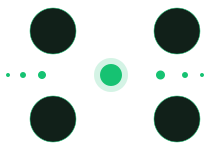

# Quant·ion



[](https://github.com/josoriom/quantion/actions/workflows/test.yml)

**Ionic Toolkit for LCMS data processing.**

A Rust core with bindings for R, Python and JavaScript.

<br clear="right">

## Install

```bash
cargo add quantion --git https://github.com/josoriom/quantion --branch main
```

- [R](wrappers/r/README.md)
- [Python](wrappers/python/README.md)
- [JS](wrappers/js/README.md)
