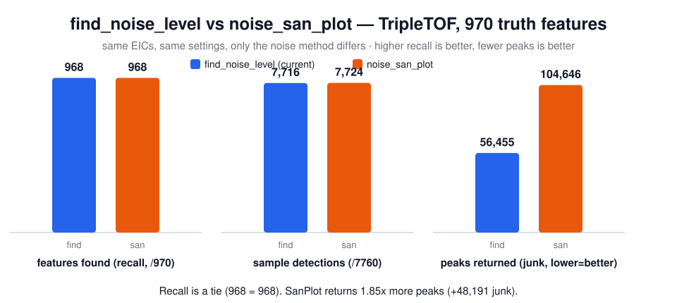
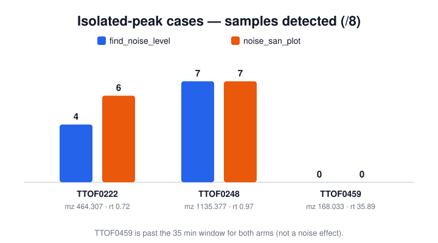

# Noise estimator benchmark: `find_noise_level` vs `noise_san_plot`

Saved so we do not have to run this again. Date: 2026-07-04.

## The question

We found a bug: `get_peak` misses a strong clean peak that sits alone on a flat baseline. The cause is inside `find_noise_level` (see [get_peak_isolated_peak_bug.md](../get_peak_isolated_peak_bug.md)). A review suggested we could just switch the noise estimator to `noise_san_plot`, which happens to fix those cases.

We had a memory that SanPlot did not give good enough results before. So we tested it on real data instead of guessing.

## The answer

**Keep `find_noise_level`. Do not switch to SanPlot.**

SanPlot finds the **same number** of true features (968 of 970) but returns **about 1.85x more peaks** — a lot of noise picked up as fake peaks. Same recall, almost double the junk. This matches what we remembered.

The real fix is to repair the single-segment branch inside `find_noise_level`. That recovers the isolated peaks **without** the extra junk.

## The numbers



| method | features found (/970) | sample detections (/7760) | peaks returned (junk) |
|---|---|---|---|
| `find_noise_level` (current) | **968** | 7716 | **56,455** |
| `noise_san_plot` | **968** | 7724 | **104,646** |

- Recall: a tie. 968 = 968.
- Sample detections: almost the same (+8 for SanPlot).
- Peaks returned: SanPlot returns **48,191 more** peaks on the same signals. That is the junk.

`peaks_returned` is the junk measure: both methods see the exact same EICs, so more peaks means more false detections.

## The isolated-peak cases



| feature | m/z | rt | `find_noise_level` | `noise_san_plot` |
|---|---|---|---|---|
| TTOF0222 | 464.3071 | 0.72 | 4/8 | 6/8 |
| TTOF0248 | 1135.377 | 0.97 | 7/8 | 7/8 |
| TTOF0459 | 168.0326 | 35.89 | 0/8 | 0/8 |

SanPlot helps a little here (TTOF0222, 4 → 6 samples), but the feature was already found by both, so the final score does not move. TTOF0459 is past the 35 min window for both arms, so it is a window artifact, not a noise result.

## Why SanPlot is worse for our data

SanPlot assumes the noise is symmetric around a center. Our EIC is baseline-subtracted and clamped at zero, so the lower half of that shape is gone. On a sparse window SanPlot reports a noise floor near zero. That helps it catch weak isolated peaks, but it also lets real noise through everywhere else. That is the extra 48,191 peaks.

`find_noise_level` fits how a chromatogram really looks (many small wiggles, a few real peaks) and gives a sane noise. Its only flaw is one branch, which is a small fix.

## How the test was run

One process ran `find_peaks` **twice** on every EIC — once with `NoiseMethod::FindNoiseLevel`, once with `NoiseMethod::SanPlot` — on the exact same real data. Only the noise method changed.

- Dataset: MTBLS733 TripleTOF 6600, 8 samples, 970 truth features, 7760 EICs.
- Settings (same as the real `get_features` run): time 0.4–35 min, EIC 20 ppm / 0.005 Da, min intensity 1000, min width 5 points, min S/N 3, min r² 0, EMG shape, keep frequency 1, match a peak within ±0.5 min of the truth rt.

Code: [core/examples/noise_bench.rs](../../examples/noise_bench.rs).

Reproduce:

```
cargo run --manifest-path core/Cargo.toml --release --example noise_bench \
  /Users/josoriom/Documents/pqc/mtbls733/tripletof6600 \
  /Users/josoriom/Documents/pqc/mtbls733/truth-tripletof6600.tsv
```

Redraw the figures from `results.json`:

```
python3 core/tests/noise_method_benchmark/make_figures.py
```

## Honest limits of this test

- This is the `find_peaks` level (one targeted EIC per truth feature). The noise method acts only here, so the full `get_features` numbers move with it. The 1.85x peak ratio strongly predicts many more junk features in a full untargeted run.
- TripleTOF has only 3 isolated-peak cases, so this run mainly measures the **downside** (junk). The **upside** — recovering the 27 QE HF isolated-peak cases — comes from the `find_noise_level` single-segment fix, not from SanPlot.

## Files here

- `results.json` — all the numbers, settings, and the reproduce command.
- `figure_summary.svg` — recall, sample detections, and junk peaks.
- `figure_isolated.svg` — the three isolated-peak cases.
- `make_figures.py` — rebuilds the figures from `results.json`.
